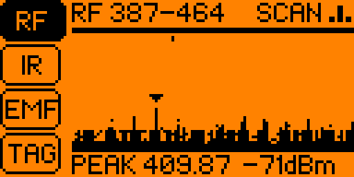
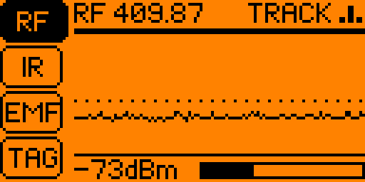
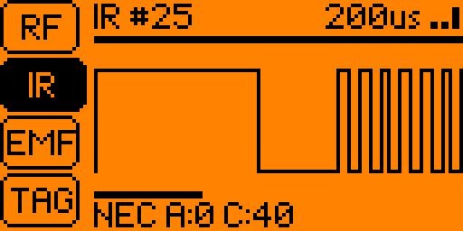
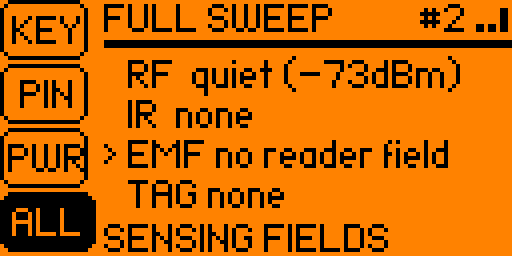
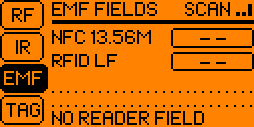
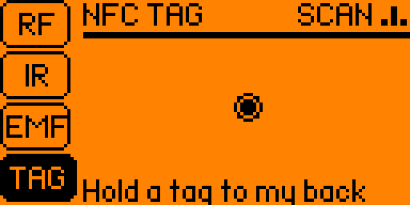
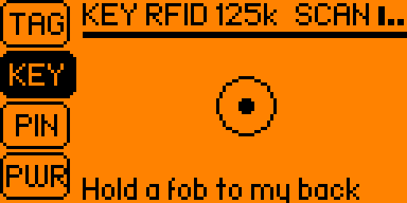
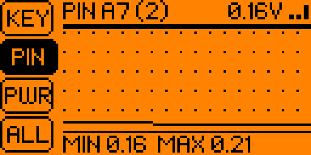
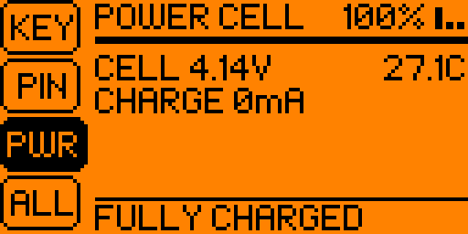
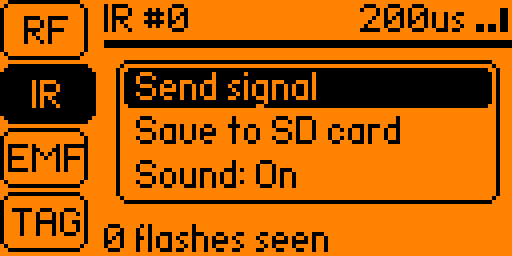

# Tricorder

A handheld signal scanner for the Flipper Zero, styled after a certain
starship's field instrument. Eight sensors, one sweep that runs them all.

 

 

 

 

 

## Sensors

| Tab | What it shows |
|---|---|
| **RF** | Sub-GHz spectrum sweep across a band, with peak hold and the strongest frequency, or a scrolling waterfall. Lock on to a frequency to chart its strength over time and name any protocol the firmware's decoders recognise. |
| **IR** | The last infrared signal as a waveform, with the protocol, address and command when it can be decoded. The signal can be sent back out or saved to the SD card. |
| **EMF** | Whether an NFC (13.56 MHz) or low-frequency RFID reader field is nearby, the LF field's frequency, and a short history. |
| **TAG** | Which NFC protocols a tag held to the back answers to, and its UID. |
| **KEY** | Reads 125 kHz RFID fobs and cards, or iButton keys. |
| **PIN** | Voltage on a GPIO pin (0 to 2.5 V) as a number and a trace. |
| **PWR** | Battery voltage, temperature, charge and current draw. |
| **ALL** | Full sweep: runs RF, IR, EMF and TAG in turn and reports what each found. |

## Controls

| Button | Action |
|---|---|
| Up / Down | Switch sensor |
| Left / Right | RF scan: change band. RF track: tune (hold for bigger steps). IR: scroll the waveform. KEY: RFID or iButton. PIN: choose pin |
| OK | RF: lock on to the peak / return to the sweep. IR: zoom. Other tabs: clear |
| Hold OK | Menu: RF view and modulation, IR send and save, sound |
| Back | Leave RF track or the menu, otherwise exit |

The tricorder warbles when it has a contact, higher for stronger signals.
Sound, the last tab and the other choices are remembered between runs.

## What it transmits

Sub-GHz is receive-only. The IR tab transmits only when you choose
**Send signal**. The TAG and KEY tabs power the NFC and RFID coils to wake
tags, as any reader does.

Saved infrared signals are appended to `infrared/Tricorder.ir` on the SD
card, which opens in the Flipper's own Infrared app.

## The PIN probe

The probe measures 0 to 2.5 V against ground (pin 8, 11 or 18). Do not
connect anything above 3.3 V to a GPIO pin.

## Building

```
ufbt launch
```

Built against the official firmware SDK with [ufbt](https://github.com/flipperdevices/flipperzero-ufbt).

## License

MIT
